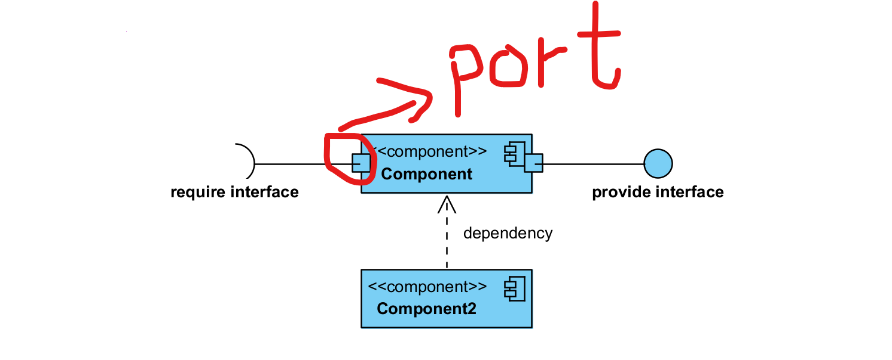
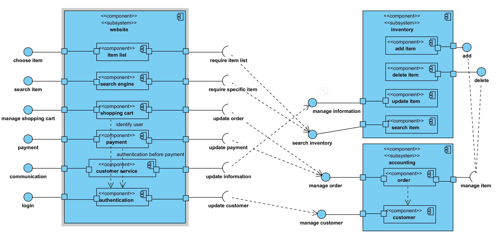
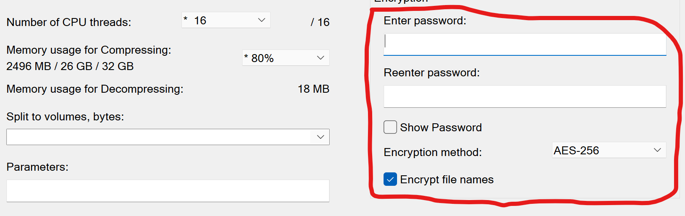

# User Guide of Component Diagram for Versed User
## Content
- [Introduction](#introduction)
- [Preparation](#preparation)
- [Analyze an Online Shopping System](#analyze)
- [Safety Measures](#safety)
- [References](#references)
 

### Introduction {#introduction}
Today, you will analyze a component diagram of Online Shopping System to see how component diagram can help in designing and explaining complex system in more understandable way. By using Subsystem, Component, Port, Interface, Relationship, component diagram shows the internal mechanism of the system clearly and straightforwardly. You can't just use text to achieve the same effect, this is the main advantage of Unified Modeling Language (ULM).
 

### Preparation {#preparation}

- require interface: means the component need information from other component
- provide interface: means the component provides information to other component
- dependency: means the component needs other component's support to do its job
- the small square at the edge of the component, port: means the component exposes interfaces through here, different ports expose different interfaces
 

### Analyze an Online Shopping System {#analyze}

1. There are two main parts of the system, frontend and backend. User interact with frontend to buy item, and the frontend interact with the backend to get the data it needs.
Website subsystem is frontend, Inventory and Accounting subsystems are backend.
2. In Website subsystem:
    - item list: show items to the user, so user can choose the item they want to buy
    - search engine: provides the search functionality to user, can be used to search specific item
    - shopping cart: let user manages the items they want to buy
    - payment: gives user payment methods
    - customer service: let user contacts the company, to complain or inquiry
    - authentication: provides login functionality, after login, user can make a payment or add something to their shopping cart
3. There are two parts in the backend: Inventory and Accounting subsystems.
4. Inventory provides functionalities about search and manage items. When the website needs to show item list or user is searching a specific item, Inventory subsystem get the data for the website. When user complain about an item, Inventory subsystem will record that information to the item.
5. Accounting subsystem manages order and customer. When user put or cancel an order, Accounting subsystem will record that and update the data in Inventory subsystem. When user make a payment, it will update the order and the customer's data.
6. This is not a completed online shopping system, more components and subsystems are needed to create a real system.
 

### Safety Measures {#safety}

Encryption is the best method to protect our personal information and intellectual property. If our computer is attacked by hacker or stolen by thief, and we didn't encrypt sensitive and valuable data, the data will be exposed to other people. The criminals can use our sensitive data to do more attack on us, and using our intellectual property as their owns.
Therefore, you should always encrypt sensitive and valuable data to protect it.
 

### References {#references}
Fakhroutdinov, K., 2022. UML component diagram example for online shopping - search engine, shopping cart, inventory, customers, orders.. [online] Uml-diagrams.org. Available at: <https://www.uml-diagrams.org/examples/online-shopping-uml-component-diagram-example.html?context=cmp-examples> [Accessed 5 February 2022].